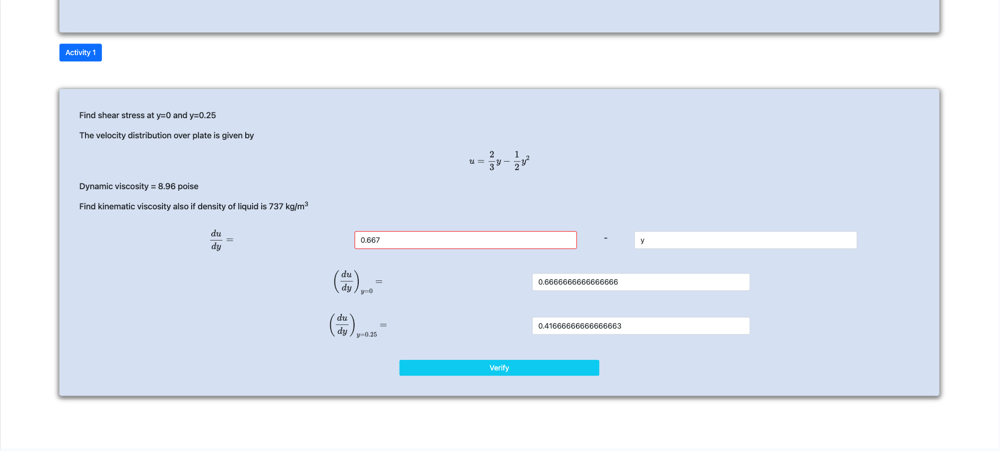
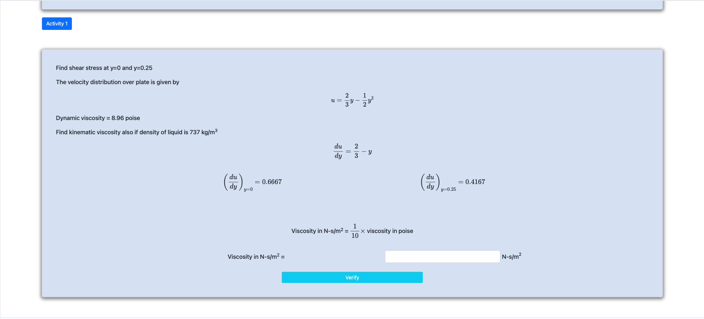
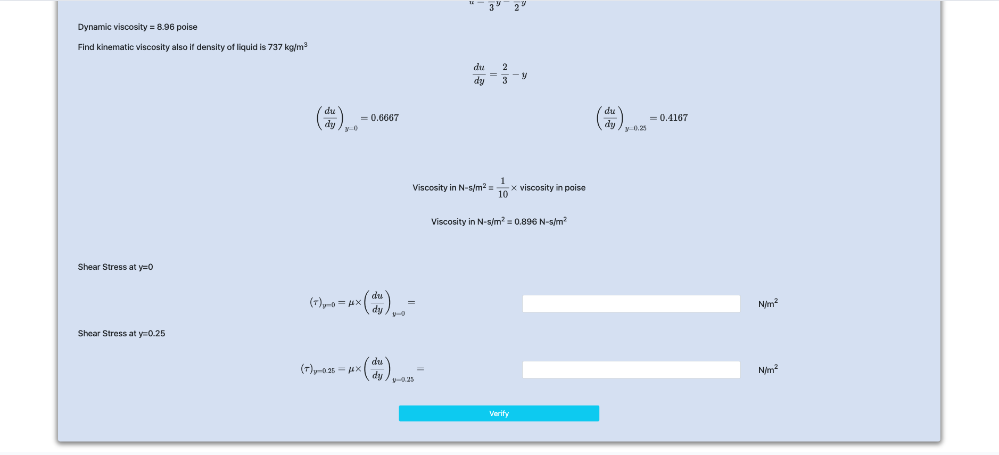
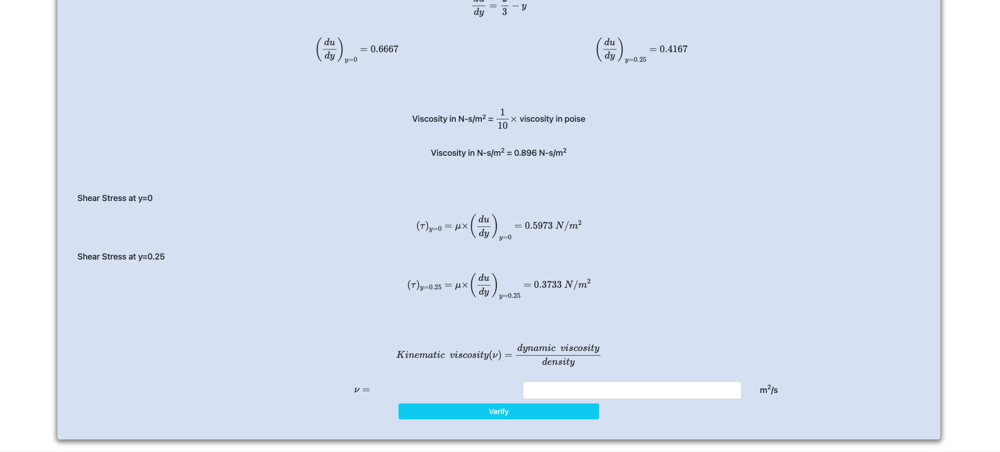
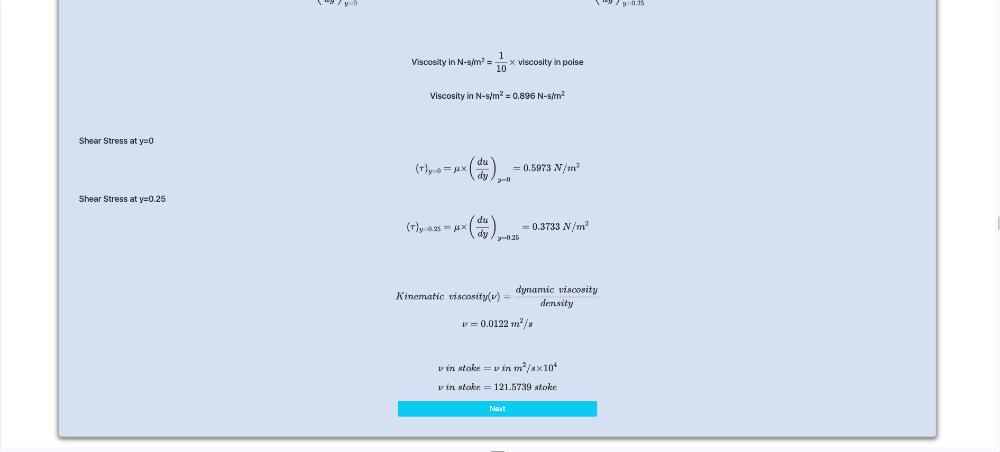

<h2>Follow the below steps to perform the experiment on the simulator</h2>
 

Step 1 : Click next to start.

Step 2 : Enter the differentiation, and enter its value at y = 0 and y = 0.25

Step 3 : Calculate the viscosity

Step 4 : Calculate the shear stress

Step 5 : Calculate the shear stress

Step 6 : Calculate the v in stoke

